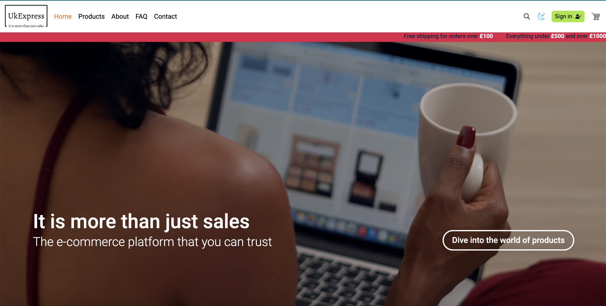
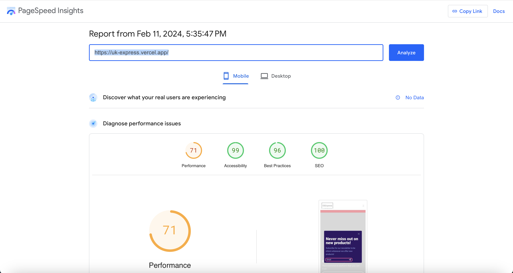
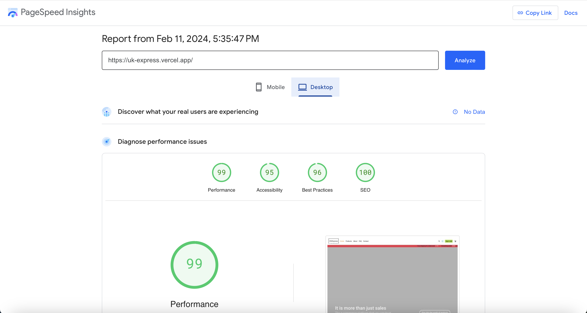

# UkExpress

UkExpress is a British e-commerce web app that was founded in London. UK, 2004. UkExpress deliver to Spain, France and Germany as well.

Build on front-end development with Vite. The products are fetched and cached with Redux Toolkit Query from dummyjson.com API. Authentication is implemented via Supabase API.



#### Links to GitHub and Demo

- [GitHub](https://github.com/NDraganov/uk-express)
- [Demo](https://uk-express.vercel.app)

## Built with technologies

- Vite(React) + TypeScript - Front-end web app.
- React Router - Routes and navigation.
- Redux Toolkit - Global state managment.
- React useState Hook - Local state managment.
- Redux Toolkit Query - Fetching and caching the products.
- React Hook Form - Validation of the forms.
- DummyJSON.com API - fetching the products data.
- Supabase - Authentication for users.
- Tailwind CSS - Styling the components.
- React Toastify - Push notifications.

## Features

### Header

- Brand logo
- Main navigation - navigate to the main pages.
- Search icon - opens the search modal.
- Dark mode button - toggles the light and dark modes and renders relative icons.
- Sign-in button - navigates to the sign-in page.
- Cart icon - opens the cart modal.

### Footer

- Newsletter - email input for sign-up for news.
- Footer navigation
  - Shop menu - navigates to all products.
  - Learn menu - links to about and contact pages.
  - Follow menu - links to social media.
- Back to top button
- Policies links

### Home page

- Newsletter modal - it renders after a delay of a few seconds.
- Video background - overlay with slogan and a button for all products.
- Carousel with Images
- Sales - Sales description with a button for products on sale.
- Top categories
- New collection - new product items.

### Products page

- Categories navigation - renders tabs for all 20 categories of products.
- Outlet - renders the relative pages for the selected category tab. The page contains
  a product list of product items(card).
- Product item(card)
  - An image of the product
  - Title of the product
  - Rating of the product
  - Price of the product
  - Buttons - one for reviewing the selected product page and one for adding to the cart.
- Pagination - for all products page.

### Single product page

- Product gallery on the left - created from scratch.
- Product details on the right
  - Product title
  - Product brand
  - Rating and link for the reviews
  - Product price - some of the products are on sale(every product under 500 and over 1000). The data from the API contains the discount percentage and the price on sale for every product. I calculate the original price.
  - In stock availability
  - Tag - I created it by using the product category.
  - Product description
  - Add to cart section - buttons to select a quantity and a button to add it to the cart.
- Product reviews - render the comment from the dummy JSON API.
  - User - I added a dummy time the review was made.
  - Text(comment)
  - Likes - I create a small section with like and dislike buttons.
  - Reviews pagination.

### Pagination

- Created from scratch

### Breadcrumbs

- Created from scratch

### Cart modal

- My cart text and a close button
- Conditional shipping details
- Cart items list
- Subtotal due price
- Conditional button - if the cart is empty, render a Start shopping button. If items are available, render the Proceed to checkout button.

### About page

- Our story - Short company story and an image of a team work.
- Our mission - Short info about the company mission and purpose.

### Contact page

- Contact details on the left
  - Phone number, email and address.
- Contact form on the right
  - Map image - background of the contact form.
  - Contact form - inputs for name, email, phone and a message.

### Sign-in page

- Sign-in form on the left - inputs for email and password.
  - Sign-in(submit) button
  - Demo button - set the inputs with an existing account credentials.
- Sign-up link on the right - a button for the sign-up page.

### Sign-up page

- Sign-in link on the left - a button for the sign-in page.
- Sign-up form on the right - inputs for first and last names, email, address,
  country code and phone number, password, confirm password.
- Terms and conditions link
- Sign-up(submit) button

### User account page

- Greeting with the user name
- Sidebar navigation on the left
- Outlet on the right - rendering the page for the selected sidebar link.
  - Account information
    - Form - inputs for the user name, email, phone and address.
    - Edit/Cancel - button to allow the user to change the info or to cancel(to disable the inputs).
    - Update(submit) button
  - My cart
    - Cart items list - render a list of the user shopping items(products) if available.
      If items are not available, render a text for an empty cart.
    - Checkout button - if items are available, render a button to proceed to the checkout page.
  - Change password
    - Form - inputs for the new password and the confirmed new password.
    - Update(submit) button
- Sign-out(button) link - navigates to the sign-in page.

### Checkout page

- Checkout details on the left
  - Shopping items list
  - Shipping options
    - Standard - cost 5, and it takes 4-7 days. If the price for the shopping is 100 or more, the user is eligible for free standard shipping.
    - Express - cost 15, and it takes 2-4 days.
  - Price details - subtotal, shipping and a total price to pay.
- Payment options on the right
  - Apple pay button
  - Shipping information - email, name, country and address.
  - Payment details - card details.
  - Pay button
  - Payment processing modal - animated icon and conditional text for the stages.

### Order confirmation page

- Confirmation order details on the left
  - Greeting the user
  - Order confirmation message
  - Order number
  - Join creators club card
  - Delivery details
- Order summary on the right - number of items, subtotal, shipping and the total payed price.
  - Need help links

## Testing and QA

For this project, testing and QA haven't been implemented and performed because of my lack of knowledge so far.
The only test is me, testing the features for correct calculations and performance of what it intended to do.
I ran the project URL through the Page Speed Insights website. Only the mobile performance was below the fast scale. I assume the large(9,729 KiB) video file is the cause.

Mobile testing results



Desktop testing results



## Optimization

### Video

The original size of the background video on the Home page was 77.1 MB in MPEG-4 file. I compressed it, which resulted in a 9.3 MB.

### Images

The collective size of the images on the file system was over 10 MB. I converted them into JPEG files and compressed them, which resulted in a 1.9 MB.

### Code splitting

I used the React API lazy to load the pages when the user needed to. I left only the Home page as it was needed initially.
The initial size of the index.js file was more than 570 KB, after the code splitting - 466 KB.

## Errors and Bugs

### TypeScript

First time using TypeScript. It was a challenge for me, but in the end, I overcame all the Type Errors and achieved a good basic knowledge of how to use it.

Initially, for some features like pagination, I used the library Flowbite. Sometimes, I get a Type Error, which I fix through the node_modules folder library files. That worked fine until the project was deployed. Immediately recognise the problem - node_modules folder is part of the git ignore file, therefore not committed to GitHub. I decided to keep the node_modules folder ignored.
Solution: I start building the features from scratch.

For the Redux Toolkit, I have to check the docs on their website for usage with TypeScript.
For the fetched data, I have to add an undefined type. That causes problems sometimes when I use the data. I overcome that one as well.

Example

```js
// Instead to use only the left side, I add && operator to assure the system that the data is available and not undefined
<Component title={data?.products?.id.title && data.products.id.title} />
```

### Video

The video background on the Home page play on full screen on mobile devices. After researching on the internet, I found a post on Stackoverflow with the same issue. One of the suggestions says that Safari and Chrome require attributes "mute" and "playInline" to play as a background.

```js
<video
  className="h-screen w-full object-cover"
  src={homeVideo}
  autoPlay
  muted
  playsInline
  loop
></video>
```

### Active navigation link

First time using the React router. I didn't know how exactly to style the active link. After I checked the official docs, I found the way - pass an argument to a function inside the "className".

```js
<NavLink
  to="/messages"
  className={({ isActive, isPending }) =>
    isPending ? "pending" : isActive ? "active" : ""
  }
>
  Messages
</NavLink>
```

### Cart modal

I want to close the cart modal, when the user clicks on the close(x) button or outside the modal. I use the useEffect to add an event listener for the body to close the modal. Then, when the user clicks on any element inside the modal, it closes.

Example

```js
useEffect(() => {
  document.body.addEventListener("click", () => {
    dispatch(closeCartModal());
  });
}, [dispatch]);
```

Then, I google how to prevent the modal from closing, when the user clicks on it. I found the event stopPropagation(). I added it to every clickable element.

Example

```js
function handleOpenCart(e: FormEvent) {
  e.stopPropagation();
  dispatch(openCartModal());
}
```

### Add to cart - Product page

#### Add to cart action

Initially, I had a problem implementing add to add-to-cart button for the product page. When I used the action from the cart Slice, it resulted in Type Errors for the arguments.
My solution was to pass props to the AddToCart component and add an undefined type. That caused a bit of a prop drilling, but it worked fine.

Product page - create variables for each of the arguments.

```js
const { title } = useParams();
const id = product?.id;
const price = product?.price;
const thumbnail = product?.thumbnail;
```

Cart slice action payload

```js
addToCart(
  state,
  action: PayloadAction<{
    id: number | undefined;
    title: string | undefined;
    price: number | undefined;
    thumbnail: string | undefined;
    quantity: number | undefined;
  }>,
)
```

Add to cart components props

```js
interface AddToCartProps {
  id: number | undefined;
  title: string | undefined;
  price: number | undefined;
  thumbnail: string | undefined;
  quantity: number | undefined;
}
```

Function, executed on click

```js
function handleAddToCart(e: FormEvent) {
  e.stopPropagation();
  dispatch(addToCart({ id, title, price, thumbnail, quantity }));
  dispatch(openCartModal());
}
```

#### Quantity

For the product page add-to-cart, I implement increase and decrease buttons for product count(quantity).

- I had a problem with properly calculating the quantity. I want to implement functionality - if the item is available in the cart to add the product count to the item quantity(Example: 2 iPhones in the cart. On the product page the user sets product count to 3, it should result in 5 item quantity in the cart). If the item is not available in the cart, the item quantity should be equal to the product count.

The first attempt was unsuccessful because I didn't set proper conditions and forgot to push the product count to the items array.

- The second problem was the initial value for the product count set to 0. If the add-to-cart is clicked when the product count is 0, the cart item quantity increases with 1. I resolve the problem by setting the initial state to 1. At the same time is more appropriate.

Add to cart action

```js
// If items available in the cart
if (itemIndex >= 0) {
  // If the item is available in the cart and the user set the product count
  if (state.items[itemIndex].quantity > 0 && state.productCount > 0) {
    // Increase the quantity with the product count
    state.items[itemIndex].quantity =
      state.items[itemIndex].quantity + state.productCount;
  } else {
    // Increase the item quantity with 1
    state.items[itemIndex].quantity++;
  }
  // If the item is not available in the cart
} else if (state.productCount > 0) {
  // Push the item into the cart with the set product count
  state.items.push({ ...action.payload, quantity: state.productCount });
} else {
  // If the item is not available in the cart and the product count is not set, push the item with quantity 1
  state.items.push({ ...action.payload, quantity: 1 });
  state.isSuccess = true;
}
```

## Acknowledgments

- [The Ultimate React Course 2024: React, Redux & More
  ](https://www.udemy.com/course/the-ultimate-react-course/) by [Jonas Schmedtmann](https://www.udemy.com/user/jonasschmedtmann/).
